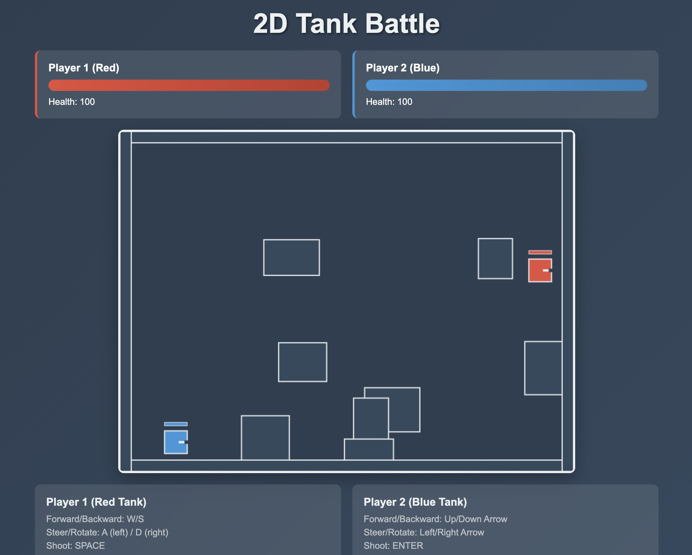

# 🎮 2D Tank Battle

A thrilling browser-based 2D tank battle game built with HTML5 Canvas and JavaScript. Battle your friend in intense tank-to-tank combat!



## ✨ Features

- 🎯 **Two-player local multiplayer**
- 🏃‍♂️ **Real-time tank movement and shooting**
- 🔄 **Independent tank rotation system**
- 🧱 **Obstacle-based battlefield**
- ❤️ **Health system with visual indicators**
- 💥 **Advanced collision detection**
- 📱 **Responsive design**
- 🎨 **Modern UI with smooth animations**

## 🚀 Quick Start

### Option 1: Direct Browser
Simply open `index.html` in your web browser.

### Option 2: Local Server (Recommended)
```bash
# Using Python (recommended)
python3 server.py

# Alternative: Using Python's built-in server
python3 -m http.server 8000

# Then open: http://localhost:8000
```

### Option 3: Using npm scripts
```bash
npm run start
# or
npm run dev
```

## 🎮 Game Controls

### Player 1 (Red Tank)
- **Movement**: W/A/S/D (relative to tank facing direction)
- **Rotation**: Q (left) / E (right)
- **Shooting**: SPACE

### Player 2 (Blue Tank)  
- **Movement**: Arrow Keys (relative to tank facing direction)
- **Rotation**: Z (left) / X (right)
- **Shooting**: ENTER

### Movement Mechanics
- **W/↑**: Move forward in facing direction
- **S/↓**: Move backward from facing direction
- **A/←**: Strafe left (perpendicular to facing direction)
- **D/→**: Strafe right (perpendicular to facing direction)
- **Rotation**: Independent of movement - tanks can rotate while stationary

## 🎯 Game Mechanics

- 💯 Each tank starts with **100 health points**
- 💥 Each bullet hit deals **25 damage**
- 🚫 Tanks cannot move through obstacles or boundaries
- ⏰ Bullets have a **cooldown period** to prevent spam
- 🏆 Game ends when one player's health reaches **0**

## 📁 Project Structure

```
2d-tank-battle/
├── 📄 index.html         # Main HTML file
├── 🎨 css                # Game styling
│   └── styles.css
├── ⚙️ game.js            # Game logic and classes
├── 🐍 server.py          # Development server
├── 📦 package.json       # Project configuration
├── 📖 README.md          # This file
└── 📚 docs/
    ├── README.md         # Detailed documentation
    └── game-flow.md      # Game architecture
```

## 🛠️ Technical Details

- **Framework**: Vanilla JavaScript (ES6+)
- **Graphics**: HTML5 Canvas 2D Context
- **Architecture**: Object-oriented with ES6 classes
- **Collision Detection**: AABB (Axis-Aligned Bounding Box)
- **Animation**: RequestAnimationFrame for 60fps
- **Styling**: Modern CSS with Grid and Flexbox

## 🎨 Game Classes

### 🎮 Game Class
Main game controller managing the game loop, state, and coordination between objects.

### 🚗 Tank Class
Player representation handling movement, rotation, health, shooting, and rendering.

### 🔫 Bullet Class
Projectile management with movement, collision detection, and damage application.

## 🏗️ Development

The game uses a clean, modular architecture:

1. **Game Loop**: Continuous update and render cycle
2. **Event System**: Keyboard input handling
3. **Collision System**: Efficient AABB collision detection
4. **Rendering System**: Canvas-based 2D graphics

## 🚀 Future Enhancements

- 🌐 Network multiplayer support
- 🎵 Sound effects and background music
- 💥 Particle effects for explosions
- 🏆 Score tracking and leaderboard
- 🎮 Gamepad support
- 📱 Mobile touch controls
- 🗺️ Multiple battle arenas
- 🛡️ Power-ups and special abilities

## License

Copyright © 2025 Monk Journey Team. All Rights Reserved.

This project is proprietary and confidential. Unauthorized reproduction, distribution, or disclosure is prohibited. No license, express or implied, to any intellectual property rights is granted by this document.

See the [LICENSE](LICENSE) file for full details.
