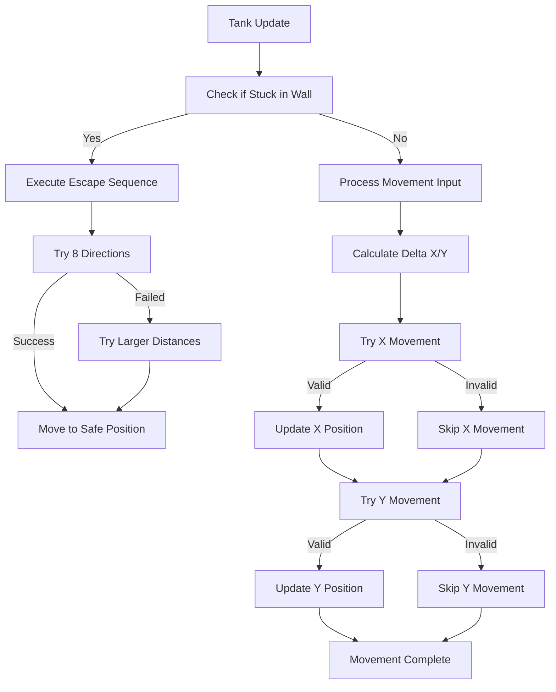

# Collision Detection & Control System Improvements

## Issues Fixed

### 1. Tank Spawn Collision Issue
**Problem**: Tanks would sometimes spawn inside walls or obstacles, making them stuck from the start.

**Solution**: 
- Added `findSafeSpawnPosition()` method to find collision-free spawn locations
- Uses multiple attempts (up to 100) to find safe positions
- Ensures minimum distance between players (100 pixels)
- Falls back to emergency positions if no safe spot is found

### 2. Wall Penetration and Stuck Issue
**Problem**: Tanks could move deep into walls and get permanently stuck.

**Solution**:
- Improved movement system with separate X and Y axis collision detection
- Added `canMoveTo()` method for better collision validation  
- Added wall escape mechanism with `isStuckInWall()` and `escapeFromWall()`
- Prevents movement instead of allowing penetration

## New Collision System Flow



## Technical Implementation

### Safe Spawn System
```javascript
findSafeSpawnPosition(tankWidth, tankHeight) {
    // Try up to 100 random positions
    // Check collision with all obstacles
    // Ensure minimum distance from other players
    // Return safe coordinates or fallback position
}
```

### Improved Movement System
```javascript
handleMovement(keys, obstacles, canvasWidth, canvasHeight) {
    // Separate X and Y axis movement
    // Individual collision checks for each axis
    // Allows sliding along walls
}
```

### Wall Escape Mechanism
```javascript
escapeFromWall(obstacles, canvasWidth, canvasHeight) {
    // Try 8 directions at increasing distances
    // Automatically moves tank to nearest safe position
    // Prevents permanent stuck situations
}
```

### 3. Improved Control System
**Problem**: Controls required too many keys (Q/E for Player 1, Z/X for Player 2) and weren't intuitive.

**Solution**:
- Integrated steering/rotation into existing movement keys
- A/D (Player 1) and Left/Right arrows (Player 2) now act as:
  - **Steering** when moving forward/backward (W/S or Up/Down)
  - **Rotation** when stationary
- Eliminated need for separate rotation keys (Q/E/Z/X)

## New Control Scheme

### Player 1 (Red Tank)
- **W**: Move forward
- **S**: Move backward  
- **A**: Steer left (while moving) / Rotate left (when stationary)
- **D**: Steer right (while moving) / Rotate right (when stationary)
- **SPACE**: Shoot

### Player 2 (Blue Tank)
- **Up Arrow**: Move forward
- **Down Arrow**: Move backward
- **Left Arrow**: Steer left (while moving) / Rotate left (when stationary)  
- **Right Arrow**: Steer right (while moving) / Rotate right (when stationary)
- **ENTER**: Shoot

## Benefits

1. **No More Spawn Collisions**: Tanks always start in safe positions
2. **Smooth Wall Interaction**: Tanks can slide along walls instead of getting stuck
3. **Automatic Recovery**: Stuck tanks automatically escape to safe positions
4. **Intuitive Controls**: Natural tank-like steering behavior
5. **Simplified Control Scheme**: Fewer keys needed, more intuitive gameplay
6. **Better Player Experience**: More responsive and predictable movement
7. **Robust System**: Multiple fallback mechanisms prevent edge cases

## Performance Considerations

- Spawn position finding uses efficient early-exit collision detection
- Wall escape mechanism only runs when needed
- Separate axis movement provides better collision resolution
- Collision checks use optimized rectangle intersection algorithm