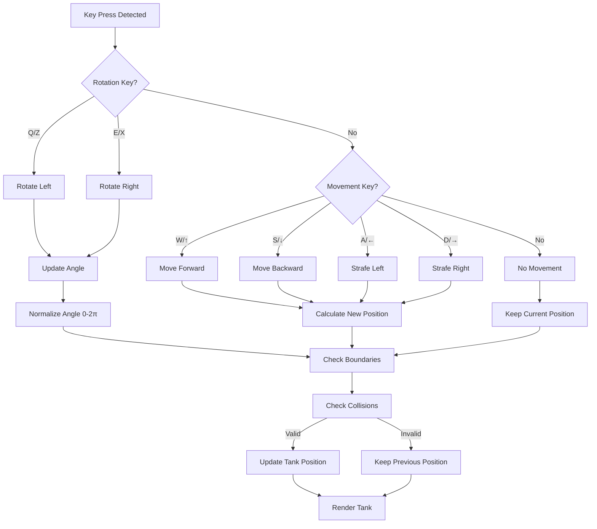

# Tank Controls Diagram

## Player 1 (Red Tank) Controls

```
Rotation:           Movement:           Shooting:
   Q                   W                  SPACE
┌─────┐            ┌─────┐               ┌─────────┐
│  ↺  │            │  ↑  │               │  SHOOT  │
│LEFT │            │ FWD │               │         │
└─────┘            └─────┘               └─────────┘
   E               A  S  D              
┌─────┐         ┌─────┬─────┬─────┐      
│  ↻  │         │  ← │  ↓  │  →  │      
│RIGHT│         │LEFT│BACK │RIGHT│      
└─────┘         └─────┴─────┴─────┘      
```

## Player 2 (Blue Tank) Controls

```
Rotation:           Movement:           Shooting:
   Z                   ↑                  ENTER
┌─────┐            ┌─────┐               ┌─────────┐
│  ↺  │            │  ↑  │               │  SHOOT  │
│LEFT │            │ FWD │               │         │
└─────┘            └─────┘               └─────────┘
   X               ←  ↓  →              
┌─────┐         ┌─────┬─────┬─────┐      
│  ↻  │         │  ← │  ↓  │  →  │      
│RIGHT│         │LEFT│BACK │RIGHT│      
└─────┘         └─────┴─────┴─────┘      
```

## Movement Mechanics

```
Tank Facing Direction and Movement:

        Forward (W/↑)
            ↑
            │
Strafe ←────┼────→ Strafe
Left        │     Right
(A/←)   Tank Facing  (D/→)
            │
            ↓
        Backward (S/↓)

Rotation Controls:
Q/Z: ↺ (Counter-clockwise)
E/X: ↻ (Clockwise)
```

## Tank Orientation System

```
Angle System (Radians):
        
        -π/2 (270°)
            ↑
            │
π (180°) ←──┼──→ 0 (0°)
            │
            ↓
        π/2 (90°)

Tank starts facing right (angle = 0)
Positive rotation = clockwise
Negative rotation = counter-clockwise
```

## Control Flow Diagram

