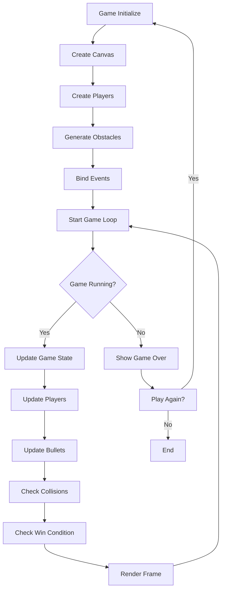

# Game Flow Documentation

## Game Architecture Diagram

```
┌─────────────────────────────────────────────────────────────┐
│                    2D Tank Battle Game                     │
└─────────────────────────────────────────────────────────────┘
                                │
                                ▼
┌─────────────────────────────────────────────────────────────┐
│                      Game Class                            │
│  - Canvas management                                        │
│  - Game state (running/stopped)                           │
│  - Player instances                                        │
│  - Bullet management                                       │
│  - Collision detection                                     │
│  - Game loop (update/render)                              │
└─────────────────────────────────────────────────────────────┘
                                │
                ┌───────────────┼───────────────┐
                ▼               ▼               ▼
┌─────────────────────┐ ┌─────────────────┐ ┌─────────────────┐
│    Tank Class       │ │  Bullet Class   │ │   Obstacles     │
│  - Position (x,y)   │ │  - Position     │ │  - Static       │
│  - Health (100)     │ │  - Velocity     │ │  - Collision    │
│  - Movement         │ │  - Owner        │ │  - Boundaries   │
│  - Shooting         │ │  - Damage       │ │                 │
│  - Collision        │ │                 │ │                 │
└─────────────────────┘ └─────────────────┘ └─────────────────┘
```

## Game State Flow



## Collision Detection Flow

```
Player Movement:
┌─────────────────┐
│ Key Press Event │
└─────────────────┘
         │
         ▼
┌─────────────────┐
│ Calculate New   │
│ Position        │
└─────────────────┘
         │
         ▼
┌─────────────────┐
│ Check Boundary  │
│ Collision       │
└─────────────────┘
         │
         ▼
┌─────────────────┐
│ Check Obstacle  │
│ Collision       │
└─────────────────┘
         │
         ▼
┌─────────────────┐
│ Update Position │
│ if Valid        │
└─────────────────┘

Bullet Collision:
┌─────────────────┐
│ Bullet Update   │
└─────────────────┘
         │
         ▼
┌─────────────────┐
│ Check Bounds    │
└─────────────────┘
         │
         ▼
┌─────────────────┐
│ Check Obstacles │
└─────────────────┘
         │
         ▼
┌─────────────────┐
│ Check Players   │
└─────────────────┘
         │
         ▼
┌─────────────────┐
│ Apply Damage /  │
│ Remove Bullet   │
└─────────────────┘
```

## Event Handling

```
Input Events:
- keydown → keys[code] = true
- keyup → keys[code] = false

Movement Processing:
- Check keys array in update loop
- Calculate new position
- Validate against collisions
- Update tank position and rotation

Shooting System:
- Space/Enter key detection
- Cooldown timer check
- Create bullet instance
- Add to bullets array
```

## Game Classes Overview

### Game Class
- **Purpose**: Main game controller
- **Responsibilities**: 
  - Initialize game components
  - Handle game loop
  - Manage game state
  - Coordinate between objects

### Tank Class
- **Purpose**: Player representation
- **Responsibilities**:
  - Handle movement and rotation
  - Manage health and shooting
  - Render tank graphics
  - Process input controls

### Bullet Class
- **Purpose**: Projectile management
- **Responsibilities**:
  - Move in straight line
  - Check collisions
  - Apply damage
  - Self-destruction logic

## Performance Considerations

- Uses `requestAnimationFrame` for smooth 60fps animation
- Efficient collision detection with early exit conditions
- Bullet cleanup when out of bounds
- Minimal DOM manipulation during gameplay